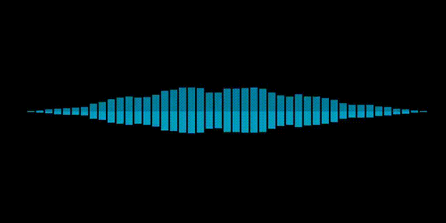
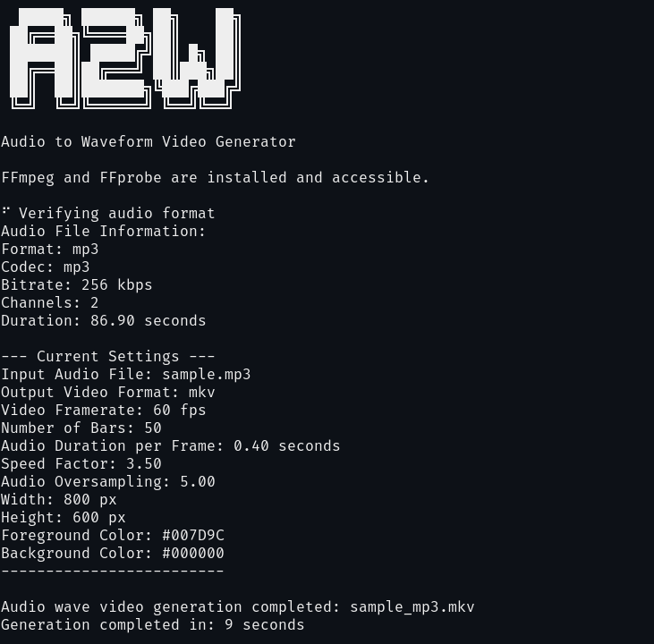

# Go Audio to Waveform (goa2w) Video Generator

A command line tool written in Go which generates a waveform video from an audio files (mp3, wav etc.). The visual representation of the audio waveform is displayed as bars in a smooth animation. Uses FFmpeg to encode and output as various video formats including mp4, avi, webm.

 
  
[Full sample file with audio sample_mp3.mp4](sample_mp3.mp4)

## Acknowledgements

This project is an adaptation of the Python version of [**SEEWAV**](https://github.com/adefossez/seewav) by [**adefossez**](https://github.com/adefossez). The original code is licensed under **The Unlicense**. This Go version replicates the functionality of the Python code, with optimizations to better suit the Go programming language.

## Requirements

- `ffmpeg` and `ffprobe` installed and available in your system's `PATH`. (https://www.ffmpeg.org/download.html)

- Go 1.22+ if building and running the program (https://go.dev/doc/install).


## Installing

### Option 1 Download the pre-built Binary files from [Releases](https://github.com/bradsec/goa2w/releases)

### Option 2 Use Go to install the latest version
If you have Go installed you can install the latest version of goa2w with this command:
```terminal
go install github.com/bradsec/goa2w@latest
````

### Option 3 Clone Repo and Build

```terminal
git clone https://github.com/bradsec/goa2w.git
cd goa2w
go build -o goa2w main.go

# Copy the goa2w binary/executable to a directory in your system PATH
```


## Usage Examples

`goa2w -i sample.mp3`

`goa2w -i sample.mp3 -format "webm"`



### Options
```terminal
Options:
  -b int
    	Number of bars on the video at once (default 50)
  -bg string
    	Background color (RGB or hex: #RRGGBB) (default "#000000")
  -duration float
    	Duration in seconds from the seek time
  -fg string
    	Foreground color (RGB or hex: #RRGGBB) (default "#007D9C")
  -format string
    	Output video format (e.g., mp4, avi, mkv, webm, mov) (default "mp4")
  -h int
    	Height in pixels of the animation (default 600)
  -i string
    	Input audio file
  -oversample float
    	Lower values will feel less reactive (default 5)
  -r int
    	Video framerate (default 60)
  -seek float
    	Seek to time in seconds in the video
  -speed float
    	Higher values mean faster transitions between frames (default 3.5)
  -t float
    	Amount of audio shown at once on a frame (default 0.4)
  -w int
    	Width in pixels of the animation (default 800)
```


